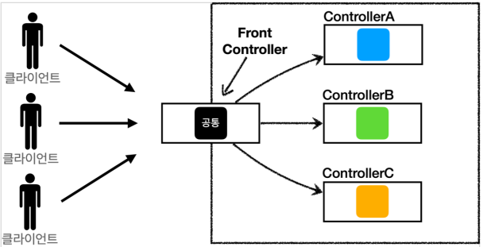
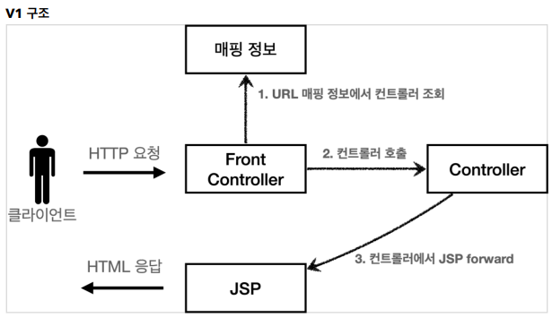
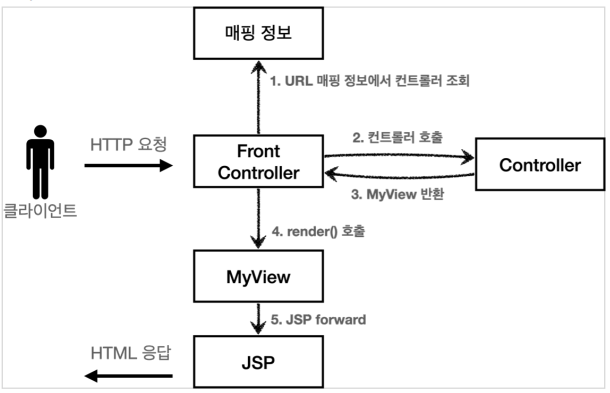
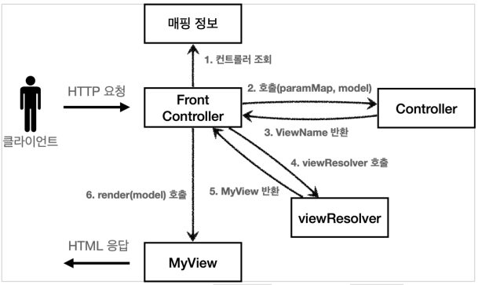
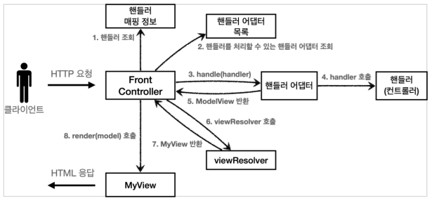
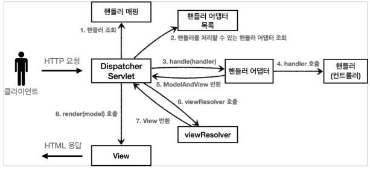

# Spring MVC 

------------
## 1. MVC 프레임워크 만들기
### FrontController 패턴의 특징
+ 프론트 컨트롤러 서블릿 하나로 클라이언트의 요청을 받음
+ 프론트 컨트롤러가 요청에 맞는 컨트롤러를 찾아서 호출
+ 입구를 하나로!!
+ 공통 처리 가능



+ ### FrontController 단계적 도입 - v1
프론트 컨트롤러를 단계적으로 도입하자.


```java
private Map<String, ControllerV1> controllerMap = new HashMap<>();

    public FrontControllerServletV1() {
        controllerMap.put("/front-controller/v1/members/new-from", new MemberFormtControllerV1());
        controllerMap.put("/front-controller/v1/members/save", new MemberSaveControllerV1());
        controllerMap.put("/front-controller/v1/members", new MemberListControllerV1());
    }

    @Override
    protected void service(HttpServletRequest req, HttpServletResponse resp) throws ServletException, IOException{
        String requestURI=req.getRequestURI();

        ControllerV1 controller=controllerMap.get(requestURI);
        }
```
핵심은 위의 코드다. FrontController에 위와 같이 매핑정보를 부여하여 ```getRequestURI```메서드를 통해 주소로 들어오는 값을 매핑하여 ```Map```을 통해 컨트롤러를 호출한다.

---
+ ### View 분리 - v2


```java
public class MyView {

    private String viewPath;

    public MyView(String viewPath) {
        this.viewPath = viewPath;
    }

    public void render(HttpServletRequest request, HttpServletResponse response) throws ServletException, IOException {
        RequestDispatcher dispatcher = request.getRequestDispatcher(viewPath);
        dispatcher.forward(request, response);
    }
}
```
기존 v1에서 Controller에서 직접 JSP페이지로 넘겨주던 방식을
```MyView```클래스를 새로 생성하여 기존에 ```getRequestURI```을 가져와 ```forward```해야했던 번거로움이 사라짐.

+ ### Model 추가 - v3


```java
@Override
    protected void service(HttpServletRequest req, HttpServletResponse resp) throws ServletException, IOException {

        String requestURI = req.getRequestURI();

        ControllerV3 controller = controllerMap.get(requestURI);
        if (controller == null) {
            resp.setStatus(HttpServletResponse.SC_NOT_FOUND);
            return;
        }

        Map<String, String> paramMap = createParamMap(req);
        ModelView mv = controller.process(paramMap);

        String viewName = mv.getViewName();
        MyView view = viewResolver(viewName);

        view.render(mv.getModel(), req, resp);
    }

    private MyView viewResolver(String viewName) {
        return new MyView("/WEB-INF/views/" + viewName + ".jsp");
    }

    private Map<String, String> createParamMap(HttpServletRequest req) {
        Map<String, String> paramMap = new HashMap<>();
        req.getParameterNames().asIterator()
                .forEachRemaining(paramName -> paramMap.put(paramName, req.getParameter(paramName)));
        return paramMap;
    }
```
전체적인 FrontController의 코드 양이 증가했지만, viewResolver와 요청 파라미터 정보를 Map으로 넘기도록 하여 
구체적인 Controller에서는 훨씬 코드가 간결해진 것을 확인할 수 있다. 

```java
public class MemberFormControllerV3 implements ControllerV3 {

    @Override
    public ModelView process(Map<String, String> paramMap) {
        return new ModelView("new-form");
    }
}
```
```ModelView```

이 컨트롤러는 서블릿 기술을 전혀 사용하지 않는다. 따라서 구현이 매우 단순해지고, 테스트 코드 작성시
테스트 하기 쉽다.
```HttpServletRequest```가 제공하는 파라미터는 프론트 컨트롤러가 ```paramMap```에 담아서 호출해주면 된다.
응답 결과로 뷰 이름과 뷰에 전달할 Model 데이터를 포함하는 ```ModelView``` 객체를 반환하면 된다.

+ ### 단순하고 실용적인 Controller - v4

+ 기본적인 구조는 v3와 유사하지만, 컨트롤러가 ```ModelView```를 반환하지 않고 ```viewName```을 반환한다.

```java
public class MemberFormControllerV4 implements ControllerV4 {
    
 @Override
 public String process(Map<String, String> paramMap, Map<String, Object> model) {
     return "new-form";
    }
}
```
+ 기존에 반환하던 ```ModelView```가 사라지고, String 값으로 반환하는 것을 확인한 수 있다. 그리고, 파라미터에 ```Map<String, Object> model```이 추가된 것을 확인할 수 있다.
+ 이는 정말 단순하게 "new-form"이라는 논리 이름만 반환하면 되는 것이다.
+ 이번 영상에서의 명언은 "프레임워크나 공통 기능이 수고로워야 사용하는 개발자가 편리해진다."

+ ### 유연한 컨트롤러 - v5

> 만약 어떤 개발자는 v3 방식으로 개발하고 싶고, 어떤 개발자는 v4의 방식으로 개발하고 싶다면 어떻게 해야할까?

```java
public interface ControllerV3 {
 ModelView process(Map<String, String> paramMap);
}
```

```java
public interface ControllerV4 {
 String process(Map<String, String> paramMap, Map<String, Object> model);
}
```
+ 두 인터페이스 v3, v4는 완전히 다른 인터페이스이기 때문에, 서로 호환이 되지 않는다. 
+ 비유로 따지자면 110V와 220V 플러그 두 개를 동시에 사용하고 싶은데, 한 가지의 콘센트밖에 지원을 하지 않는 것이다.
+ 이를 처리하기 위해 어뎁터 패턴을 도입하여 이 문제를 해결한다.




```java
public interface MyHandlerAdapter {
    
 // handler는 컨트롤러를 의미한다.
 // 어댑터가 해당 컨트롤러를 처리할 수 있는지 판단하는 메서드다.
 boolean supports(Object handler); 
 
 
 ModelView handle(HttpServletRequest request, 
                  HttpServletResponse response,
                  Object handler) throws ServletException, IOException;
}
```
+ 위와 같은 방식으로 어뎁터 패턴의 인터페이스를 구현한다.

+ ### Spring MVC의 구조


+ 우리가 이전에 구현했던 v5의 MVC 구조와 매우 유사하다. 거의 같다고 봐도 될 정도로 유사하다. 
+ ```FrontController```가 단지 ```DispatcherServlet```으로 이름만 바뀐 것 뿐, 그 동작 방식과 흐름은 완전히 동일하다.

### 동작 흐름을 살펴보면,
>1. 핸들러 조회 : 핸들러 매핑을 통해 요청 URL에 매핑된 핸들러(컨트롤러)를 조회한다.
>2. 핸들러 어댑터 조회: 핸들러를 실행할 수 있는 핸들러 어댑터를 조회한다.
>3. 핸들러 어댑터 실행: 핸들러 어댑터를 실행한다.
>4. 핸들러 실행: 핸들러 어댑터가 실제 핸들러를 실행한다.
>5. ModelAndView 반환: 핸들러 어댑터는 핸들러가 반환하는 정보를 ModelAndView로 변환해서 반환한다.
>6. viewResolver 호출: 뷰 리졸버를 찾고 실행한다.
>7. View 반환: 뷰 리졸버는 뷰의 논리이름을 물리이름으로 바꾸고, 렌더링 역할을 담당하는 뷰 객체를 반환한다.
>8. 뷰 렌더링: 뷰를 통해서 뷰를 렌더링 한다.

+ ### Spring MVC 시작하기
### ```@RequestMapping``` 기반의 MVC 컨트롤러 구현
```java
@Controller
public class SpringMemberFormControllerV1 {
    
    @RequestMapping("/springmvc/v1/members/new-form")
    public ModelAndView process() {
    return new ModelAndView("new-form");
    }
}
```
> ```@Controller```
+ 스프링이 자동으로 스프링 빈으로 등록함. (내부에 ```@Component``` 애노테이션이 있기 때문에 컴포넌트 스캔의 대상이 됨)
+ 스프링 MVC에서 애노테이션 기반 컨트롤러로 인식한다.
> ```@RequestMapping```
+ 요정 청보를 매핑함. 해당 URL이 호출되면 이 메서드가 호출된다. 애노테이션을 기반으로 동작하기 때문에, 메서드의 이름은 임의로 지으면 됨.
  
+ ### Spring MVC v1, v2
+ ### V1
> ```@Controller```와 ```@RequestMapping```을 통한 컨트롤러의 간결화
```java
@Controller
public class SpringMemberFormControllerV1 {

    @RequestMapping("/springmvc/v1/members/new-form")
    public ModelAndView process() {
        return new ModelAndView("new-form");
    }
}...
```
> 이러한 컨트롤러 클래스를 총 세 개를 만들어야 한다. (list와 save)
> 하지만 v2에서는 이러한 컨트롤러 클래스를 하나의 클래스에서 메서드에 ```@RequestMapping```을 통해 관리한다.

+ ### V2
```java
@Controller
@RequestMapping("/springmvc/v2/members")
public class SpringControllerV2 {

    private MemberRepository memberRepository = MemberRepository.getInstance();

    @RequestMapping("/new-form")
    public ModelAndView newform() {
        return new ModelAndView("new-form");
    }

    @RequestMapping("/save")
    public ModelAndView save(HttpServletRequest request, HttpServletResponse response) {
        List<Member> members = memberRepository.findAll();
        ModelAndView mv = new ModelAndView("members");
        mv.addObject("members", members);

        return mv;
    }

    @RequestMapping
    public ModelAndView members(HttpServletRequest request, HttpServletResponse response) {
        String username = request.getParameter("username");
        int age = Integer.parseInt(request.getParameter("age"));

        Member member = new Member(username, age);
        memberRepository.save(member);

        ModelAndView mv = new ModelAndView("save-result");
        mv.addObject("member", member);
        return mv;
    }
}
```
> 위에서 설명했듯이 하나의 클래스에서 여러 클래스를 관리한다.
> 클래스 범위에서 ```@RequestMapping```을 선언하면 중복되는 경로를 하나로 뺄 수 있다.